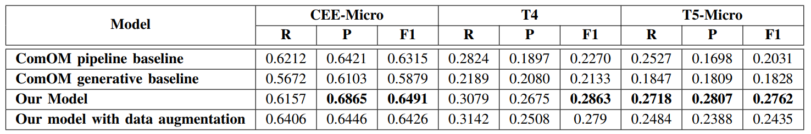

# Comparative Opinion Mining from Vietnamese Product Reviews

This repo contains the data sets and source code of our NLP final project.
Slide: (https://docs.google.com/presentation/d/1ZYOEaSgauSUvIJM182SJvfRREXZRvO3Czr9JSP4E5GI/edit#slide=id.g261b6a04064_0_60)

## Team members
- 21020467 Nguyễn Thị Thúy Hường
- 21020522 Hoàng Hùng Mạnh
  
## Task
This task aims to create models that can find opinions from product reviews. Each review has sentences that compare different parts of products.

## Dataset
The dataset is released by VLSP 2023 challenge on
Comparative Opinion Mining from Vietnamese Product
Reviews. Each review contains comparative sentences,
and the corresponding quintuples are annotated.
The following table shows the statistics of the comparative quintuple corpora.

## Approach
### Stage 1: CEE + CSI

### Stage 2, 3: Combination, Filtering + CLC
**Combination**

**Filtering**

**CLC**

**Output**

## Result
The Results of different approaches for CEE, T4 and T5 under the Exact Match metric:

